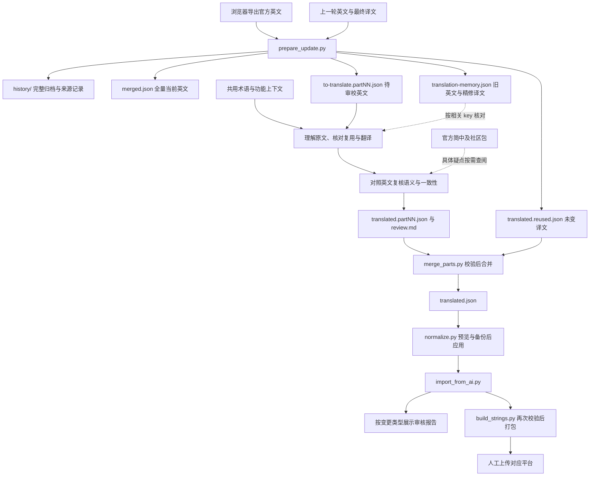

# 01 · 架构与设计原则

## 质量与职责

当前官方英文决定语义，功能上下文帮助消除歧义，共用术语表约束表达。翻译 AI 先理解原文，核对精修记忆并复用适用译文，完成其余翻译后单独复核语义与一致性，遵循 [审校规范](06-translation-style.md)。脚本只做结构化 I/O、差异检测、校验和打包。

官方简中和社区包保留在本地，遇到具体疑点时按 key 查阅；默认待译输入只包含当前英文及发生变化时的旧英文。参考译文可能有误，功能判断优先依据界面、同功能文案和官方客户端源码。

当前精修包是项目自己的翻译记忆。英文未变时默认复用已通过结构校验的译文；发现语义错误、上下文变化或术语冲突时定向审校。模型升级后仍执行相同质量标准，按实际问题决定修订范围，避免无依据的表达漂移。

## 增量数据流

## 关键约束

- 以旧 `merged.json` 和对应 `translated.json` 比较新英文。同 key 英文变化必须审校；新一轮仅需下载英文。
- 更新前归档旧 raw、parsed、work 文件和 dist。参考文件保留在原目录与归档中，供按需检索。
- `translation-memory.json` 将旧英文与旧精修译文成对保存。查看旧译时必须同时看它对应的英文，不能将旧含义套用到新原文。
- 默认每片 100 条。分片是存储边界，同功能文案和复数分支需要跨片核对。
- `translated.json` 是合并后规范化、人工修订与打包的唯一主文件。分片保留审校交付记录；合并后修改主文件，不重新合并旧片。
- 结构、key 覆盖和占位符校验通过，才能合并与打包。机器校验不证明语义质量，实际复核范围与疑点处理记录在 `review.md`。
- 审核报告按文案变更类型组织；`source` 仅保留实际来源，所有本轮条目都需审校。
- Android、iOS、TDesktop 和 macOS 原生客户端各自维护 key 集合，共用术语表。跨平台可复用已核对英文、功能用途、参数角色和格式的精修译文。
- 纯 Python 标准库；翻译 AI 可在当前工作区中审校，脚本不接入翻译服务。
- 最终上传保持人工操作。源文件和产物被 Git 忽略，历史归档保存在本机。

## 平台资源格式

Android 使用 translations.telegram.org 导出的 `<resources><string name="key">…</string></resources>` XML；复数以 `_zero`、`_one`、`_two`、`_few`、`_many`、`_other` 后缀展开。其他三个平台使用 `.strings`。平台资源统一解析为现有 JSON 字段，打包时按平台恢复格式。
