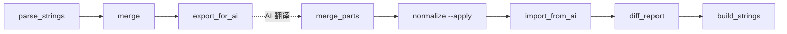

# 03 · 脚本参考手册

所有脚本都在 `scripts/`，零外部依赖，`python3 scripts/<name>.py` 直接跑。`<platform>` 参数为 `ios`、`macos` 或 `tdesktop`。

执行顺序（正常链路）：



---

## `_common.py`

共享工具模块，不直接执行。

**导出：**
- `ROOT` — 项目根目录 `Path`
- `PLATFORMS = ("ios", "macos", "tdesktop")`
- `platform_dirs(platform)` — 返回 `{raw, parsed, work, dist}` 四个 `Path`
- `parse_strings(text)` — `.strings` 文本 → `dict[str, str]`
- `dump_strings(data)` — `dict[str, str]` → `.strings` 文本（按 key 字母序输出）

**内部：**
- `_STRING_RE` — Apple `.strings` 字符串正则
- `_strip_comments(text)` — 仅剥离**字符串外部**的 `/* */` / `//` 注释
- `_escape` / `_unescape` — 处理 `\"` `\\` `\n` `\t` `\r` `\'` 六种转义

**注意：**
- `TDesktop` 的 `.strings` 值里可能包含 `https://`、`**markdown**`、`[a href=\"...\"]`
- 个别值里还可能出现字面量 `/* */`
- 因此不能先用全局正则粗暴删注释，否则会误删字符串内容，直接导致 key 数偏少
- 当前实现使用按字符扫描的 `_strip_comments()`，只在**字符串外部**识别注释

---

## `parse_strings.py`

**作用**：扫 `data/<p>/raw/*.strings` → `data/<p>/parsed/<stem>.json`

**用法**：
```bash
python3 scripts/parse_strings.py ios
```

**输入**：`data/<p>/raw/` 下任意数量 `.strings` 文件。
**输出**：同名 `.json`（key→value 字典），按 key 排序。

**错误**：raw 为空时 `SystemExit`。

---

## `merge.py`

**作用**：以 `en.json` 为 key 全集，对齐 `official-zh.json` + 所有 `zhcncc.json` / `ref-*.json` 参考源，输出 `work/<p>/merged.json`。

**用法**：
```bash
python3 scripts/merge.py ios
```

**识别规则**（文件名 → 语义）：
| 文件 | 角色 |
|---|---|
| `en.json` | baseline（必需） |
| `official-zh.json` | 官方简中（可选，通常存在） |
| `zhcncc.json` | 社区参考包（可选） |
| `ref-<name>.json` | 任意额外参考源，名字去掉 `ref-` 前缀作为 refs key |

**输出结构**：见 `docs/04-data-format.md#merged.json`

**统计打印**：每个参考源的 key 覆盖率。

---

## `seed_ios_ref.py`

**作用**：把已完成的 iOS 精修译文按**英文原文**反查后注入为 macOS 的参考源，避免重复翻译跨平台相同文案。

**用法**：
```bash
# 前置: iOS 已跑完全流程 (work/ios/translated.json 就位)
#       macOS 三件套已 parse (data/macos/parsed/en.json 就位)
python3 scripts/seed_ios_ref.py
python3 scripts/parse_strings.py macos   # 重跑以识别新 ref
```

**原理**：
- 用 `data/ios/parsed/en.json` + `work/ios/translated.json` 建 TM: `{en_text: final}`
- 用 `data/macos/parsed/en.json` 逐 key 反查 TM
- 命中的输出到 `data/macos/raw/ref-ios-refined.strings` (标准 .strings 格式)
- 不会污染 iOS 数据；macOS 只是多了一个叫 `ios-refined` 的参考源

**为什么对齐维度是英文而不是 key**：iOS 和 macOS 是独立 key 空间 (key 同名重叠仅 ~11%)，但同产品英文文案大量重叠 (~49%)。按 key 对齐会漏掉绝大多数可复用译文。

**输出**：`data/macos/raw/ref-ios-refined.strings`

**下一步**：跑 `merge.py macos`，`refs.ios-refined` 自动纳入；AI 看到这一列后大概率 `adopt:ios-refined`，省一大半翻译工作量。

---

## `export_for_ai.py`

**作用**：把 `merged.json` 复制一份为 `to-translate.json`，可选切分为 `part01..partNN`，并写出 `PROMPT.md`。

**用法**：
```bash
python3 scripts/export_for_ai.py ios              # 单文件
python3 scripts/export_for_ai.py ios --chunk 500  # 切片 (推荐)
```

**输出**：
- `work/<p>/to-translate.json` — 全量
- `work/<p>/to-translate.partNN.json` — 分片（加 `--chunk` 才有）
- `work/<p>/PROMPT.md` — 翻译 AI 任务合约（详见 `PROMPT_TEMPLATE`）

**设计**：分片按 key 字母序切，保证分片间 key 不重叠、合并时无冲突。

**注意**：`PROMPT.md` 内容是所有翻译 AI 必须遵守的合约，改动须同步 `import_from_ai.py:VALID_SOURCES` 和占位符正则。

---

## `import_from_ai.py`

**作用**：校验翻译 AI 回传的 JSON，输出 `validation.json`。

**用法**：
```bash
python3 scripts/import_from_ai.py ios                          # 校验 translated.json 对 merged.json
python3 scripts/import_from_ai.py ios --part 1                 # 校验 translated.part01.json 对 to-translate.part01.json
python3 scripts/import_from_ai.py ios --part 1 custom.json     # 指定回传文件名
```

**校验项**：
1. **结构**：顶层为 object，每个 entry 是 `{final: str, source: str, note?: str}`
2. **source 合法性**：四选一 `adopt / rewrite_ref / rewrite_official / fresh`
3. **final 非空**
4. **占位符一致性**：`final` 与 `en` 的占位符集合必须相等（`_PLACEHOLDER_RE`）
5. **key 覆盖**：缺失 / 多余都报告

**占位符正则** `_PLACEHOLDER_RE`：
- `%@` / `%1$@` — Apple object
- `%d` / `%1$d` — 整数
- `%s` / `%1$s` — C string
- `%.2f` / `%1$.2f` — 浮点
- `{xxx}` — Telegram 自定义占位符（如 `{user}`）

**错误**：`validation.json` 列出具体 key + issue 类型 + 占位符 diff；同时打印问题数摘要。

---

## `merge_parts.py`

**作用**：把 `translated.part*.json` 合并为 `translated.json`，检测重复 key 和覆盖率。

**用法**：
```bash
python3 scripts/merge_parts.py ios
```

**检查**：
- 分片间是否有 key 重复（理论上不该有，因为 export 按字母序切）
- 与 `merged.json` 的全集对比，报告 missing / extra
- 合并顺序：按文件名字母序，后者覆盖前者（有重复时）

**输出**：`work/<p>/translated.json`（按 key 字母序）

---

## `normalize.py`

**作用**：对 `translated.part*.json` 的 `final` 字段应用全局风格规则。

**用法**：
```bash
python3 scripts/normalize.py ios              # dry-run, 生成 normalize-report.md
python3 scripts/normalize.py ios --apply      # 真改, 自动创建 .bak
```

**当前规则**（按顺序执行）：
1. `您` → `你`
2. `\.{3,}` → `…`（U+2026）
3. `。{3,}` → `…`

**输出**：
- `work/<p>/normalize-report.md` — Markdown diff 报告（全量 diff）
- `--apply` 时会在每个被改动的 `translated.partNN.json` 同目录创建 `.json.bak`（首次）

**回滚**：
```bash
for f in work/ios/translated.part*.json.bak; do mv "$f" "${f%.bak}"; done
python3 scripts/merge_parts.py ios
```

**扩展新规则**：改 `normalize()` 函数内部，加一段 `re.subn` 或 `.count/.replace`。务必先 dry-run 看规模。

---

## `diff_report.py`

**作用**：生成按 source 分组高亮的 HTML 审核报告。

**用法**：
```bash
python3 scripts/diff_report.py ios [translated.json]
```

**输出**：`work/<p>/report.html`

**分组顺序**（审核优先级）：
1. 🔴 `fresh` — 完全重写，最应该审核
2. 🟠 `rewrite_official` — 改写官方机翻
3. 🟡 `rewrite_ref` — 微调参考包
4. 🟢 `adopt` — 直接采用，扫一眼即可
5. ⚫ `missing` — AI 没处理的（理论上不该有）

**视觉**：不同 source 背景色高亮，key 等宽字体，表头 sticky。

---

## `build_strings.py`

**作用**：把 `translated.json` 的 `final` 字段打包为 `.strings`。

**用法**：
```bash
python3 scripts/build_strings.py ios [translated.json]
```

**输出**：`dist/<p>/zh-Hans-custom.strings`（按 key 字母序）

**保证**：通过 `_common.dump_strings` 正确转义 `"` `\\` `\n` `\t` `\r`。已验证 `.strings → parse → build → parse` 往返一致。

**下一步**：手动上传 translations.telegram.org。
