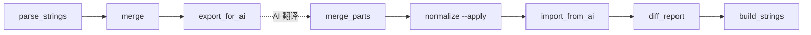

# 03 · 脚本参考手册

所有脚本都在 `scripts/`，零外部依赖，`python3 scripts/<name>.py` 直接跑。`<platform>` 参数为 `android`、`ios`、`macos` 或 `tdesktop`。

执行顺序（正常链路）：



---

## `_common.py`

共享工具模块，不直接执行。

**导出：**
- `ROOT` — 项目根目录 `Path`
- `PLATFORMS = ("ios", "macos", "tdesktop", "android")`
- `platform_dirs(platform)` — 返回 `{raw, parsed, work, dist}` 四个 `Path`
- `parse_strings(text)` — `.strings` 文本 → `dict[str, str]`
- `dump_strings(data)` — `dict[str, str]` → `.strings` 文本（按 key 字母序输出）
- `resource_suffix(platform)` — 安卓返回 `.xml`，其他平台返回 `.strings`
- `parse_resource(text, platform)` / `dump_resource(data, platform)` — 按平台解析或序列化 XML / `.strings`，保持相同 key→value 结构

**内部：**
- `_STRING_RE` — Apple `.strings` 字符串正则
- `_strip_comments(text)` — 仅剥离**字符串外部**的 `/* */` / `//` 注释
- `_escape` / `_unescape` — 处理 `\"` `\\` `\n` `\t` `\r` `\'` 六种转义

**注意：**
- `TDesktop` 的 `.strings` 值里可能包含 `https://`、`**markdown**`、`[a href=\"...\"]`
- 个别值里还可能出现字面量 `/* */`
- 因此不能先用全局正则粗暴删注释，否则会误删字符串内容，直接导致 key 数偏少
- 当前实现使用按字符扫描的 `_strip_comments()`，只在**字符串外部**识别注释

---

## `prepare_update.py`

日常增量入口；用于已有完整译文的 Android、iOS、TDesktop 与 macOS 原生客户端。

```bash
python3 scripts/prepare_update.py ios --en /path/to/ios_en.strings [--chunk 100]
```

先校验上一轮 `merged.json` 与 `translated.json`，读取并检查新下载；归档旧 raw、parsed、dist 与 work 文件，再安装新英文；从上一轮主文件保存成对的英文与精修译文。

输出 `update.json`、全量 `merged.json`、`translated.reused.json`、`translation-memory.json`、增量 `to-translate.json` 和分片、`PROMPT.md`。只有英文完全未变的 key 会复用；英文改变和新增 key 进入审校；删除 key 不进入最终包。无变化时输出空审校集，仍可合并和打包。

参数 `--chunk` 必须为正整数。来源文件名与 SHA-256 写入 `update.json`，历史保存在 `work/<p>/history/<时间>/`。旧英文与译文缺失或不匹配、新源为空、误下载其他平台时停止。

脚本保留下载输入及安装到 raw 的资源，供本轮工作使用；任务结束时由维护者按 [下载资源清理规则](../AGENTS.md#维护铁律) 清理原件和复制件。下一轮使用保存的 `merged.json`、`translated.json` 与新下载的英文准备增量。

---

## `parse_strings.py`

**作用**：扫 `data/<p>/raw/*.strings`（安卓扫 `*.xml`）→ `data/<p>/parsed/<stem>.json`

**用法**：
```bash
python3 scripts/parse_strings.py ios
```

**输入**：`data/<p>/raw/` 下任意数量对应平台的资源文件。安卓英文命名为 `en.xml`，其他平台为 `en.strings`。
**输出**：同名 `.json`（key→value 字典），按 key 排序。

**错误**：raw 为空时 `SystemExit`；安卓 XML 格式错误、根元素错误、重复 key 或非纯文本 `string` 时解析失败。

---

## `merge.py`

**作用**：从 `data/<p>/parsed/en.json` 建立全量英文基准，输出 `work/<p>/merged.json`。参考文件保留在 parsed 中供按需查阅，默认基准仅含 `en`。

**用法**：
```bash
python3 scripts/merge.py ios
```

**输出结构**：见 `docs/04-data-format.md`。打印当前英文 key 数。

---

## `seed_ios_ref.py`

按英文匹配 iOS 精修译文，生成 `data/macos/raw/ref-ios-refined.strings`，供按需查阅。采用前须核对 macOS 的功能上下文、参数角色与格式；默认待译输入保持英文。

---

## `export_for_ai.py`

**作用**：首次全量导出 `merged.json`；增量流程由 `prepare_update.py` 调用，导出本轮审校子集。可选切分为 `part01..partNN`，并将 `PROMPT_TEMPLATE` 与共用审校规范合成为 `PROMPT.md`。

**用法**：
```bash
python3 scripts/export_for_ai.py ios              # 单文件
python3 scripts/export_for_ai.py ios --chunk 100  # 切片 (推荐)
```

**输出**：
- `work/<p>/to-translate.json` — 本次待审校输入
- `work/<p>/to-translate.partNN.json` — 分片（加 `--chunk` 才有）
- `work/<p>/PROMPT.md` — 翻译 AI 任务合约（详见 `PROMPT_TEMPLATE`）

**设计**：导出仅保留 `en` 与存在时的 `previous_en`；即使旧基准中含有参考列，也不带入默认输入。分片按 key 字母序切，保证分片间 key 不重叠、合并时无冲突。同功能文案仍需跨片核对。

已有 `translated.part*.json` 时拒绝重新导出，防止输入与已译分片错配。

**注意**：`PROMPT.md` 内容是所有翻译 AI 必须遵守的合约，改动须同步 `import_from_ai.py:VALID_SOURCES` 和占位符正则。

---

## `import_from_ai.py`

**作用**：校验翻译 AI 回传的 JSON，输出 `validation.json`。

**用法**：
```bash
python3 scripts/import_from_ai.py ios                          # 校验 translated.json 对 merged.json
python3 scripts/import_from_ai.py ios --part 1                 # 校验 translated.part01.json 对 to-translate.part01.json
python3 scripts/import_from_ai.py ios --part 1 custom.json     # 指定回传文件名
```

**校验项**：
1. **结构**：顶层为 object，每个 entry 是 `{final: str, source: str, note?: str}`
2. **source 合法性**：四选一 `adopt / rewrite_ref / rewrite_official / fresh`，仅记录实际来源；英文独立翻译默认 `fresh`
3. **final 必须为字符串**：英文非空时译文必须非空；官方空串分支允许原样保留。语言包中用于分隔或省略连接词的空白串可以保留。
4. **占位符一致性**：数量、类型和写法必须相同，`%%` 也保留；无编号百分号参数必须保持顺序，带编号参数可调整顺序。
5. **key 覆盖**：缺失 / 多余都报告

**占位符正则** `_PLACEHOLDER_RE`：
- `%@` / `%1$@` — Apple object
- `%d` / `%1$d` — 整数
- `%s` / `%1$s` — C string
- `%.2f` / `%1$.2f` — 浮点
- `%.2d`、`%2$02d` — 含精度或宽度的格式化整数
- `%%` — 字面量百分号
- `{xxx}` — Telegram 自定义占位符（如 `{user}`）
- `un1` / `un2` 等 — 安卓服务消息中的具名替换标记
- `**oo**` — 安卓输入状态中的动画替换标记

**错误**：全量输出 `validation.json`，单片输出 `validation.partNN.json`；问题数大于 0 时以状态码 1 退出。`note` 存在时必须为字符串。共享函数 `validate()` 也用于合并和打包门禁。

---

## `merge_parts.py`

**作用**：按 `to-translate.part*.json` 确定本轮应有分片，合并对应译文与 `translated.reused.json`（存在时）。

```bash
python3 scripts/merge_parts.py ios
```

缺片、多余片、重复 key、任一片校验失败或合并后全量校验失败，均以非零状态退出并保留已有主文件。通过后输出 `translated.json`；若已有主文件，先复制到 `.bak`。首次全量审校不需要 `translated.reused.json`。

合并后只修改主文件；旧分片留作审校记录，重新合并会覆盖主文件上的后续编辑。

---

## `normalize.py`

**作用**：对合并后的 `translated.json` 的 `final` 字段应用全局风格规则。

**用法**：
```bash
python3 scripts/normalize.py ios              # dry-run, 生成 normalize-report.md
python3 scripts/normalize.py ios --apply      # 真改, 自动创建 .bak
```

**当前规则**（按顺序执行）：
1. `您` → `你`
2. `\.{3,}` → `…`（U+2026）
3. `。{3,}` → `…`

**输出**：
- `work/<p>/normalize-report.md` — Markdown diff 报告（全量 diff）
- `--apply` 时会在被改动的 `translated.json` 同目录创建 `.json.bak`（首次）

**回滚**：
```bash
cp work/ios/translated.json.bak work/ios/translated.json
python3 scripts/import_from_ai.py ios
```

**扩展新规则**：改 `normalize()` 函数内部，加一段 `re.subn` 或 `.count/.replace`。务必先 dry-run 看规模。

---

## `diff_report.py`

**作用**：按文案变更类型展示当前英文、变化前英文、上一轮精修译文、最终译文、来源记录和备注。

**用法**：
```bash
python3 scripts/diff_report.py ios [translated.json] [--update]
```

**输出**：默认 `work/<p>/report.html`；`--update` 按 `to-translate.json` 仅展示本轮审校条目，输出 `update-report.html`。

**数据来源**：英文来自基准，旧英文与精修译文来自 `translation-memory.json`，变更分类来自 `update.json`。首次初始化没有历史数据时，显示全量文案。

**分组**：尚无译文、新增文案、英文变化、既有文案审校和其他条目。仅显示有条目的组。官方英文与译文均为空的分支视为完整条目。所有本轮条目均需审校，`source` 仅作追溯，参考包不作为默认对照列。

---

## `build_strings.py`

**作用**：把 `translated.json` 的 `final` 字段打包为 `.strings`（安卓为 `.xml`）。

**用法**：
```bash
python3 scripts/build_strings.py ios [translated.json]
```

**输出**：`dist/<p>/zh-Hans-custom.strings`；安卓为 `dist/android/zh-Hans-custom.xml`（按 key 字母序）

**门禁**：每次打包都对当前英文重新校验 key 覆盖、结构和占位符；失败不会覆盖已有成品。

**保证**：通过 `_common.dump_resource` 选择平台格式并正确转义 `"` `\\` `\n` `\t` `\r`。XML 使用标准库序列化实体与属性。端到端测试验证 `.strings` 与 XML 的解析、构建和再解析结果一致。

**下一步**：手动上传 translations.telegram.org。
